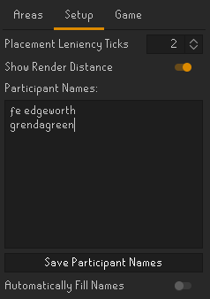

# HideAndSeekTracker
A player tracker for the hide and seek (GieliGuessr) events hosted in the official Old-School Runescape discord server.

## Features
  - Automatic placement tracking of participants.
  - Timing Leniency for shared placements.
  - Capture Area import and export function for easy sharing between hosts.
  - Export of placement and hints to clipboard for easy pasting into spreadsheets.

## setting up a game

### Creating Capture Areas
To track whoever reaches you first we'll first need to create a 'Capture Area'
These can be created from the 'Area' tab in the hide and seek side panel.
This will give you a new area creation panel to define an area around your character. Resize the area to your liking and click the 'Tick' button to place the capture area in the world. Now its ready to track players entering the area.
##### note: do not make the capture areas smaller than two tiles in width or height, these can be skipped over when a player runs across it

Capture area's you've created are shown in the 'Area' tab.
You can change the name and color of these area's to your liking.
You may also hide any unused capture areas from the world, these will not be used for tracking.

### Setting up Game rules
After setting up the desired Capture Areas you can set up the participant list.
Simply enter the character name of every player who wishes to participate and click the 'Save Participant Names' button.
Duplicate names will be automatically removed from the list.

If there are a lot of participants you can also place down a capture area automatically add playernames of anyone inside it to the list using the 'Automatically Fill Names' option.

The 'Placement Leniency Ticks' option changes within how many ticks two players have to finnish in order to share a position on the leaderboard.
We recommend setting this to 2 ticks at its lowest as that's most reliable.

###### note: at 0 ticks players entering the area on the same tick will not share a spot, the player whose name comes first in the alphabet will be placed first
###### note: at 1 tick players running one tile behind each other may or may not get to share a placement depending on what tile they enter the area on.

### Tracking players

After the rules have been setup and the names of all participating players have been entered you can swith over to the 'Game' tab.

Its your job to stand in the capture area to track the players entering.

make sure the entire capture area is within your render distance so everyone gets tracked.
Parts of the area outside of render distance are shown in a different color as shown in the picture below. In this case people entering the dock from the corsair cove will not be counted properly.

When players enter the Area they will automatically be added to the scoreboard.

Update the hint counter whenever a new hint is given.

After a round is over copy the scores to your clipboard with the buttons at the top and paste them to a spreadsheet software of your choice.

