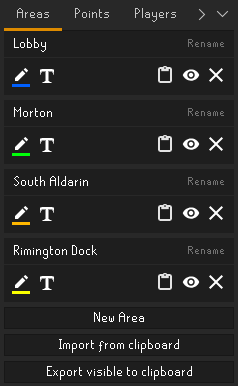

# HideAndSeekTracker
A player tracker for the hide and seek (GieliGuessr) events hosted in the official Old-School Runescape discord server.

## What's new!
  - Added Customizable Point system
  - Games can now have multiple rounds
  - Improved the result export format.
  - Changed the old export option to a developer option.

## Features
  - Automatic placement tracking of participants.
  - Timing Leniency for shared placements.
  - Customizable score system.
  - Capture Area import and export function for easy sharing between hosts.
  - Easy copying of results to clipboard.

## Setting up a game

### Creating Capture Areas
To track whoever reaches you first we'll first need to create a 'Capture Area'
These can be created from the 'Area' tab in the hide and seek side panel.
This will give you a new area creation panel to define an area around your character. Resize the area to your liking and click the 'Tick' button to place the capture area in the world. Now its ready to track players entering the area.
##### note: do not make the capture areas smaller than two tiles in width or height, these can be skipped over when a player runs across it

Capture areas you've created are shown in the 'Area' tab.
You can change the name and color of these areas to your liking.
You may also hide any unused capture areas from the world, these will not be used for tracking.

### Setup points and penalties
After setting up the desired Capture Areas you can modify how points are given to every player.
Points can be positive to give points to a player or negative to penalize a player.
Negative points aren't carried over to the next round

The score rules in the image below are as follows:
 - The player who finishes first gets 5 points,
 - The player who finishes second gets 4 points,
 - Players finishing 3rd through 5th get 3 points each,
 - Players finishing 6th through 10th get 2 points each,
 - Anyone finishing past 10th place doesn't get any points.
 - Players get a point penalty for every hint given before they finished.

### Add participants
When the rules are all set up all there is left to do is to add the participants of the game.
Simply enter the character name of every player who wishes to participate and click the 'Save Participant Names' button.
Duplicate names will be automatically removed from the list.

If there are a lot of participants, or if you know people will be joining halfway through the game. you can toggle the 'Automatically Fill Names' option to automatically register anyone who enters one of your capture areas.

### Tracking players

After the rules have been setup and the names of all participating players have been entered you can switch over to the 'Game' tab.

It's your job to stand in the capture area to track the players entering.

make sure the entire capture area is within your render distance so everyone gets tracked.
Parts of the area outside of render distance are shown in a different color as shown in the picture below. In this case people entering the dock from the corsair cove will not be counted properly.

When players enter the Area they will automatically be added to the scoreboard of the active round.

Update the hint counter whenever a new hint is given.

At the end of a round you can start a new round by pressing the  button.
You can navigate between the results of past round by using the arrows at the top of the panel.

You can copy the results of each round to your clipboard by pressing the clipboard icon at the bottom. 

## Other settings
### placement Leniency
The 'Placement Leniency Ticks' option changes within how many ticks two players have to finish in order to share a position on the leaderboard.
We recommend setting this to 2 ticks at its lowest as that's most reliable.

###### note: at 0 ticks players entering the area on the same tick will not share a spot, the player whose name comes first in the alphabet will be placed first
###### note: at 1 tick players running one tile behind each other may or may not get to share a placement depending on what tile they enter the area on.

### Developer Mode
When you run an event where multiple hosts take turns hiding you'll probably want to Collate the round data of the hosts.
If you flip on 'Use Dev mode' you'll get the button to export placement and hints used for each round.
These results can be pasted into a spreadsheet, a template can be found [here](https://docs.google.com/spreadsheets/d/1leeNCB7a1NIevrRDJqrV6-WJg6XdybvjVIjme-y32zE/edit?usp=sharing).

Make sure each host has an exact copy of the player names list, as this will be the order the data is copied out as.
###### note: round scores aren't copied out, if you use different score rules you'll have to set those in the spreadsheet. We hope to improve on this in a future update.

## Other use cases
### Attendance counting
If you run a different type of event this plugin can also be used to count attendance.

To do this: 
 - Create a capture area in a location where players attending the event will definitely pass through.
Such as a doorway or the lobby area of a minigame. 
 - Toggle on 'Automatically Fill Names' in the players tab so everyone passing through the area while it is within render distance will be added to the participant list.

The amount of players who have passed through the capture area will be shown on the scoreboard 
and the number of players who have participated will be shown at the bottom of the scoreboard.

