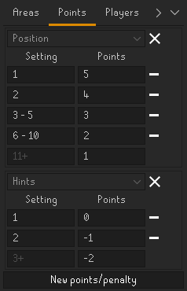
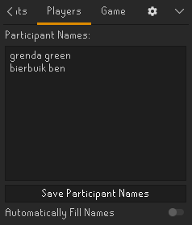

# Event Tools - Racing & Hide and Seek
A player tracker racing events such as hide and seek (GieliGuessr) events hosted in the official Old-School Runescape discord server.

## What's new!
  - Added 3 new score types.
  - Added round data importing and exporting.
  - UI improvements for the score setup panel.
  - A setting for disabling the overlay without disabling tracking.

## Features
  - Automatic placement tracking of participants.
  - Timing Leniency for shared placements.
  - Customizable score system.
  - Capture Area import and export function for easy sharing between hosts.
  - Round data import and export function for collating data from other hosts.
  - Easy copying of results to clipboard.

## Setting up a game
Before you can run your event you'll have to set up your capture areas, 
decide how your players will receive points
and enter the names of the participants of the race.

The article below will guide you through the steps of setting up your game.

### Creating Capture Areas
To track whoever reaches you first we'll first need to create a 'Capture Area'.
Which will serve as your finish line.
These can be created from the 'Area' tab in the side panel.
This will give you a new area creation panel to define an area around your character. Resize the area to your liking and click the 'Tick' button to place the capture area in the world. Now its ready to track players entering the area.
##### Note: do not make the capture areas smaller than two tiles in width or height, these can be skipped over when a player runs across it

Capture areas you've created are shown in the 'Area' tab.
You can change the name and color of these areas to your liking.
You may also hide any unused capture areas from the world, these will not be used for tracking.

### Setup points and penalties
After setting up the desired Capture Areas you can modify how points are given to every player.
Points can be positive to give points to a player or negative to penalize a player.
Negative points aren't carried over to the next round

The plugin supports 5 different scoring types:
- Position, give points or a penalty based on in what position a player placed.
- Hints, give points or a penalty based on how many hints were given when this player finished.
- Time, give points or a penalty based on how much time a player took to finish.
- Percentile, give points or a penalty based on the percentile a player finished in. Great for large events!
- Player Name, give a bonus or penalty to a specific player.

### Add participants
When the rules are all set up all there is left to do is to add the participants of the game.
Simply enter the character name of every player who wishes to participate and click the 'Save Participant Names' button.
Duplicate names will be automatically removed from the list.

If there are a lot of participants, or if you know people will be joining halfway through the game. you can toggle the 'Automatically Fill Names' option to automatically register anyone who enters one of your capture areas.

### Tracking players

After the rules have been set up and the names of all participating players have been entered you can switch over to the 'Game' tab.

It's your job to stand in the capture area to track the players entering.

make sure the entire capture area is within your render distance so everyone gets tracked.
Parts of the area outside of render distance are shown in a different color as shown in the picture below. In this case people entering the dock from the corsair cove will not be counted properly.

When players enter the Area they will automatically be added to the scoreboard of the active round.

Update the hint counter whenever a new hint is given.

At the end of a round you can start a new round by pressing the  button.
You can navigate between the results of past round by using the arrows at the top of the panel.

You can copy the results of each round to your clipboard by pressing the clipboard icon at the bottom. 

The score total page shows the ranking of each player based on the amount of points they received over the previous rounds.

### Collating round data from other hosts
If your event has multiple hosts who each take turns tracking the finishing players.
You'll have to collate the data of every host in order to calculate the point total for each player.
Each secondary host can export their round data using the  button.
This will copy the round data in json format to the clipboard.
Ready to be pasted wherever you need.

The main host simply has to copy this data to their clipboard and hit the  button.
This will append the copied over round data to the previous rounds.

The scores will automatically be recalculated after importing.
So the main host doesn't have to worry if their other hosts are using the exact same ruleset as them.

## Other settings
### Placement Leniency
The 'Placement Leniency Ticks' option changes within how many ticks two players have to finish in order to share a position on the leaderboard.
We recommend setting this to 2 ticks at its lowest as that's most reliable.

###### Note: at 0 ticks players entering the area on the same tick will not share a spot, the player whose name comes first in the alphabet will be placed first
###### Note: at 1 tick players running one tile behind each other may or may not get to share a placement depending on what tile they enter the area on.

### Hide Unfinished Players
The 'Hide Unfinished Players' option hides any players who have not finished yet from the score board.

### Hide Overlay
The 'Hide Overlay' option disables the in game capture area overlay without disabling the tracking on any capture areas that have been set to 'Visible'.
This could be useful for capturing clean footage for your events cool highlight reel.

### Show Render Distance
The 'Show Render Distance' option shows you a blue outline of the 31x31 render distance area in which players and npc's are rendered.

